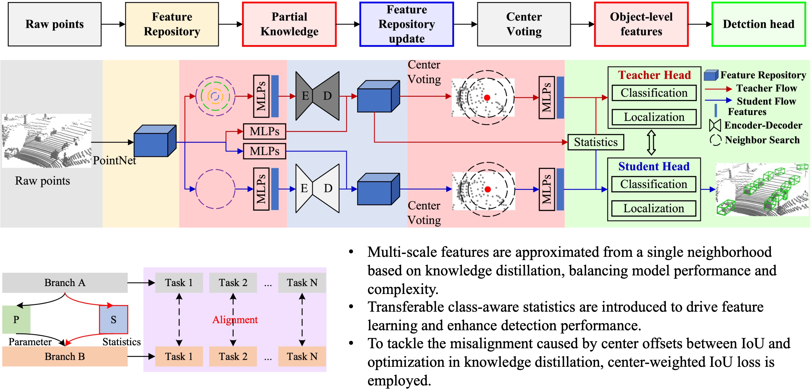

# Transferable Class Statistics and Multi-scale Feature Approximation for 3D Object Detection
<p align="center">
  
</p>

## Requirements
All the codes are tested in the following environment:
* NVIDIA 2080TI (11G)
* Linux (tested on Ubuntu 20.04)
* Python 3.10
* PyTorch 2.4.1+cu118
* [`spconv v2.x`](https://github.com/traveller59/spconv)

## Acknowledgment

Our code refers to the work [OpenPCDet](https://github.com/open-mmlab/OpenPCDet)

## Install

a. Clone this repository.
```shell
git clone https://github.com/open-mmlab/OpenPCDet.git
```

b. Copy our documents to the OpenPCDet related folder

c. Install the dependent libraries as follows:

* Install the dependent python libraries: 

```shell
pip install -r requirements.txt

```

* Install the SparseConv library, we use the implementation from [`[spconv]`](https://github.com/traveller59/spconv). 
   
d. Install this `pcdet` library and its dependent libraries by running the following command:
```shell
python setup.py develop
```

## Getting Started
### KITTI Dataset
* Please download the official [KITTI 3D object detection](http://www.cvlibs.net/datasets/kitti/eval_object.php?obj_benchmark=3d) dataset and organize the downloaded files as follows (the road planes could be downloaded from [[road plane]](https://drive.google.com/file/d/1d5mq0RXRnvHPVeKx6Q612z0YRO1t2wAp/view?usp=sharing), which are optional for data augmentation in the training):
* If you would like to train [CaDDN](../tools/cfgs/kitti_models/CaDDN.yaml), download the precomputed [depth maps](https://drive.google.com/file/d/1qFZux7KC_gJ0UHEg-qGJKqteE9Ivojin/view?usp=sharing) for the KITTI training set
* NOTE: if you already have the data infos from `pcdet v0.1`, you can choose to use the old infos and set the DATABASE_WITH_FAKELIDAR option in tools/cfgs/dataset_configs/kitti_dataset.yaml as True. The second choice is that you can create the infos and gt database again and leave the config unchanged.

```
OpenPCDet
├── data
│   ├── kitti
│   │   │── ImageSets
│   │   │── training
│   │   │   ├──calib & velodyne & label_2 & image_2 & (optional: planes) & (optional: depth_2)
│   │   │── testing
│   │   │   ├──calib & velodyne & image_2
├── pcdet
├── tools
```

### Waymo Open Dataset
* Please download the official [Waymo Open Dataset](https://waymo.com/open/download/), 
including the training data `training_0000.tar~training_0031.tar` and the validation 
data `validation_0000.tar~validation_0007.tar`.
* Unzip all the above `xxxx.tar` files to the directory of `data/waymo/raw_data` as follows (You could get 798 *train* tfrecord and 202 *val* tfrecord ):  
```
OpenPCDet
├── data
│   ├── waymo
│   │   │── ImageSets
│   │   │── raw_data
│   │   │   │── segment-xxxxxxxx.tfrecord
|   |   |   |── ...
|   |   |── waymo_processed_data_v0_5_0
│   │   │   │── segment-xxxxxxxx/
|   |   |   |── ...
│   │   │── waymo_processed_data_v0_5_0_gt_database_train_sampled_1/  (old, for single-frame)
│   │   │── waymo_processed_data_v0_5_0_waymo_dbinfos_train_sampled_1.pkl  (old, for single-frame)
│   │   │── waymo_processed_data_v0_5_0_gt_database_train_sampled_1_global.npy (optional, old, for single-frame)
│   │   │── waymo_processed_data_v0_5_0_infos_train.pkl (optional)
│   │   │── waymo_processed_data_v0_5_0_infos_val.pkl (optional)
|   |   |── waymo_processed_data_v0_5_0_gt_database_train_sampled_1_multiframe_-4_to_0 (new, for single/multi-frame)
│   │   │── waymo_processed_data_v0_5_0_waymo_dbinfos_train_sampled_1_multiframe_-4_to_0.pkl (new, for single/multi-frame)
│   │   │── waymo_processed_data_v0_5_0_gt_database_train_sampled_1_multiframe_-4_to_0_global.np  (new, for single/multi-frame)
 
├── pcdet
├── tools
```
* Install the official `waymo-open-dataset` by running the following command: 
```shell script
pip3 install --upgrade pip
# tf 2.0.0
pip3 install waymo-open-dataset-tf-2-5-0 --user
```

* Extract point cloud data from tfrecord and generate data infos by running the following command (it takes several hours, 
and you could refer to `data/waymo/waymo_processed_data_v0_5_0` to see how many records that have been processed): 
```python 
# only for single-frame setting
python -m pcdet.datasets.waymo.waymo_dataset --func create_waymo_infos \
    --cfg_file tools/cfgs/dataset_configs/waymo_dataset.yaml
```

## Training & Testing

### Train a model
You could optionally add extra command line parameters `--batch_size ${BATCH_SIZE}` and `--epochs ${EPOCHS}` to specify your preferred parameters. 

* Train with a single GPU:
```shell script
python train.py --cfg_file ${CONFIG_FILE}
```

### Test and evaluate the pretrained models
* Test with a pretrained model: 
```shell script
python test.py --cfg_file ${CONFIG_FILE} --batch_size ${BATCH_SIZE} --ckpt ${CKPT}
```

* To test all the saved checkpoints of a specific training setting and draw the performance curve on the Tensorboard, add the `--eval_all` argument: 
```shell script
python test.py --cfg_file ${CONFIG_FILE} --batch_size ${BATCH_SIZE} --eval_all
```

## Result
### KITTI 3D Object Detection Baselines
The results are the 3D detection performance on the *val* set of KITTI dataset. (trained 100epoch)

| | Car@R40 || |Pedestrian@R40| | |Cyclist@R40|| 
| :-------:|:-------:|:-------:|:-------:|:-------:|:-------:|:-------:|:-------:|:-------:|
|Easy|Mod.|Hard|Easy|Mod.|Hard|Easy|Mod.|Hard|
| 92.73| 85.62  |82.99| 63.03 |57.92 |52.26| 91.63| 72.13 |67.48|
### Waymo Open Dataset Baselines

All models are trained with **a single frame** of **20% data (~32k frames)** of all the training samples , and the results of each cell here are mAP/mAPH calculated by the official Waymo evaluation metrics on the **whole** validation set (version 1.2). (trained 30epoch)
| Vec_L1 | Vec_L2 | Ped_L1 | Ped_L2 | Cyc_L1 | Cyc_L2 | 
|----------:|:-------:|:-------:|:-------:|:-------:|:-------:|
|71.29/70.68| 62.67/62.13| 63.14/53.73| 55.10/46.74| 64.71/62.61| 62.24/60.22|
## Acknowledgment

Our code refers to the work [OpenPCDet](https://github.com/open-mmlab/OpenPCDet)
